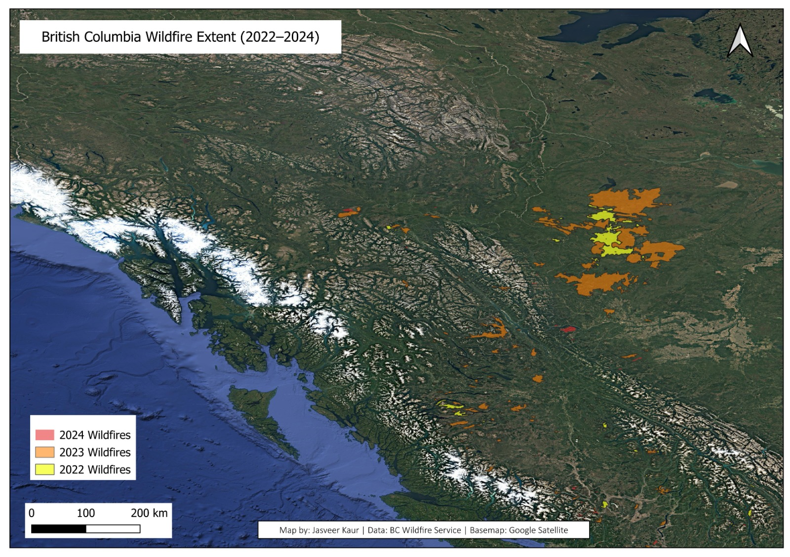

# Environmental GIS & Spatial Analysis Portfolio

A repository demonstrating open-source GIS workflows, spatial hazard assessment, and publication-ready cartographic design.

---

## Featured Project: British Columbia Wildfire Extent & Burn Assessment (2022–2024)

### 📌 Overview
This project visualizes and analyzes multi-year wildfire perimeter data across British Columbia, Canada. The objective was to evaluate landscape-level wildfire progression, identify major burn clusters, and produce a high-resolution, standardized cartographic figure suitable for environmental risk reporting.

---

### 🛠️ Technical Specifications & Methodology

* **Software & Tools:** QGIS 3.x, OpenStreetMap (OSM), GDAL/OGR
* **Coordinate Reference System (CRS):** `EPSG:3005` (NAD83 / BC Albers) – projected for accurate area and distance preservation across the province.
* **Data Sources:** 
  * *Wildfire Perimeters:* BC Wildfire Service Open Data Catalogue (Historical Fire Perimeters 2022, 2023, 2024)
  * *Basemap Imagery:* Google Satellite high-resolution imagery
* **Cartographic Workflows:**
  * Multi-layer vector polygon overlay and topology validation.
  * Hierarchical year-over-year categorized styling with calibrated opacity for topographic visibility.
  * Publication layout design with dynamic metric scale bars, custom directional indicators, and formal data provenance attribution (300 DPI export).

---

### 📂 Research & Technical Skillset

* **Spatial Analysis:** Vector/raster geoprocessing, zonal statistics, buffer modeling, CRS transformations.
* **Earth Observation:** Multi-spectral satellite indices (NDVI, dNBR burn severity, NDWI), Landsat, Sentinel-2.
* **Programming & Data:** R (`sf`, `raster`, `ggplot2`), Python (`geopandas`, `matplotlib`), SQL-based attribute filtering.
* **Field Research:** Microhabitat spatial grid design, microclimatic data logging, arid ecosystem behavioral ecology.

---

### 👤 Author
**Jasveer Kaur**  
*MSc Environmental Science (Candidate) | BSc (Hons) Zoology*  
*Research Interests: Spatial Risk Analytics, Remote Sensing, Hazard Modeling, Climate Resilience*
